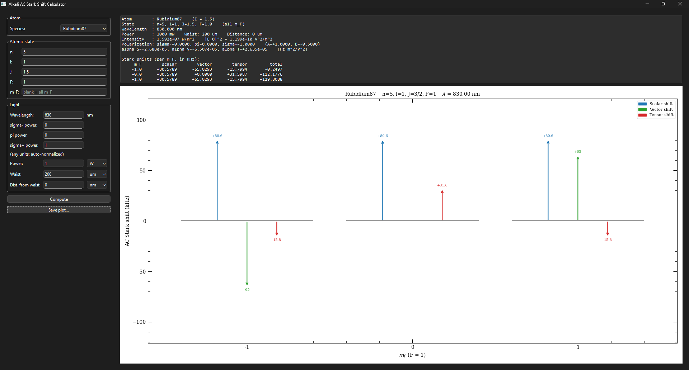
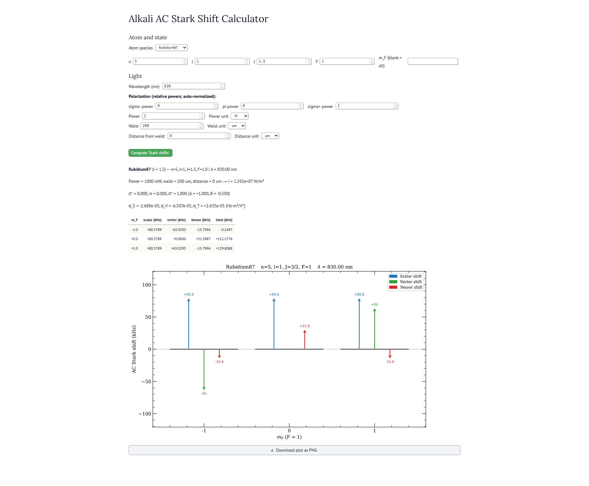

# Stark Shift Calculations

A small calculator for the AC Stark shift of alkali atoms in optical fields.
Given an atomic state $|n, l, J, F, m_F\rangle$, a wavelength, a polarization
power split, and a Gaussian beam (power, waist, axial offset from focus), it
returns the scalar, vector, and tensor light shifts in Hz.

The physics — formulas, sign conventions, validity assumptions, references —
is documented separately in [physics.md](physics.md).

## GUI Example

### PyQT



### Marimo



## Files

| File | Purpose |
|---|---|
| [calcs.py](calcs.py) | GUI-agnostic physics. Validates the state, normalizes the polarization, gets J-basis polarizabilities from ARC, projects onto F via Clebsch-Gordan, and renders the level-diagram plot. |
| [pyqt_gui.py](pyqt_gui.py) | Desktop GUI built on PyQt6 + matplotlib. |
| [marimo_gui.py](marimo_gui.py) | Browser GUI as a [marimo](https://marimo.io) reactive notebook. |
| [physics.md](physics.md) | Derivation and conventions for the formulas. |
| [prompt.md](prompt.md) | Original feature spec. |
| [output/](output/) | Sample/exported plots. |

## Installation

Python 3.10+. Install the dependencies into your environment of choice:

```sh
pip install ARC-Alkali-Rydberg-Calculator numpy scipy sympy matplotlib
pip install PyQt6        # for pyqt_gui.py
pip install marimo       # for marimo_gui.py
```

ARC is the bottleneck on first import — it downloads / builds matrix-element
databases on first use of each atom, which can take a minute.

## Running

### PyQt desktop app

```sh
python pyqt_gui.py
```

A window opens with all the inputs on the left and a text + plot output panel
on the right. Click **Compute**; if `m_F` was left blank, a level diagram is
drawn and **Save plot...** becomes enabled.

### Marimo notebook

```sh
marimo edit marimo_gui.py     # editable mode
marimo run marimo_gui.py      # read-only app
```

Same inputs as the PyQt version. Click the green **Compute Stark shifts**
button to gate the calculation (Marimo is reactive by default, and ARC calls
are too slow to run on every keystroke). When `m_F` is blank, the plot is
rendered below the table along with a **Download plot as PNG** button.

## Inputs

- **Atom species** — dropdown of all alkali classes ARC exposes
  (Li-6/7, Na, K-39/40/41, Rb-85/87, Cs).
- **n, l, J, F, m_F** — quantum numbers. `m_F` may be left blank to compute
  shifts for every $m_F \in [-F, F]$ at once. The state is validated and an
  explanatory error is shown for unphysical combinations.
- **Wavelength** in nm.
- **Polarization** — three numbers giving the relative power in
  $\sigma^{-}$, $\pi$, $\sigma^{+}$. The values are auto-normalized; only
  ratios matter, so e.g. `(1, 0, 1)` is 50/50 $\sigma^{-} / \sigma^{+}$.
- **Power** with unit selector (μW / mW / W).
- **Waist** with unit selector (μm / mm). This is the $1/e^2$ intensity
  radius at the focus, $w_0$.
- **Distance from waist** with unit selector (nm / μm / mm / m). The on-axis
  intensity at this axial offset $z$ is used.

## Outputs

- A text panel with the inputs in normalized SI form, the intensity and
  $|E_0|^2$, the J-basis polarizabilities, and either the three shifts for
  the requested `m_F` or a per-`m_F` table.
- When `m_F` is blank, a level-diagram plot of all $m_F$ states with three
  coloured arrows per state (scalar = blue, vector = green, tensor = red),
  values annotated next to each arrow. Units auto-scale to Hz / kHz / MHz /
  GHz to keep numbers readable.
- A save / download button for the plot (PNG / PDF / SVG in PyQt; PNG in
  marimo).

## Programmatic use

`calcs.compute_stark_shifts` is the single entry point and is GUI-agnostic:

```python
import calcs

result = calcs.compute_stark_shifts(
    atom_name="Rubidium87",
    n=5, l=1, j=1.5, f=3, mf=None,        # mf=None -> compute every m_F
    wavelength=1064e-9,                    # metres
    polarization_powers=(0.0, 0.0, 1.0),   # (sigma-, pi, sigma+)
    power=1e-3,                            # watts
    waist=2e-6,                            # metres
    distance=0.0,                          # metres
)

for mf, shifts in sorted(result["shifts"].items()):
    total = shifts["scalar"] + shifts["vector"] + shifts["tensor"]
    print(f"m_F={mf:+.1f}  total={total:.3e} Hz")
```

The same `result` dictionary can be passed to `calcs.plot_level_diagram(ax, result)`
to render the figure on any matplotlib axes.
